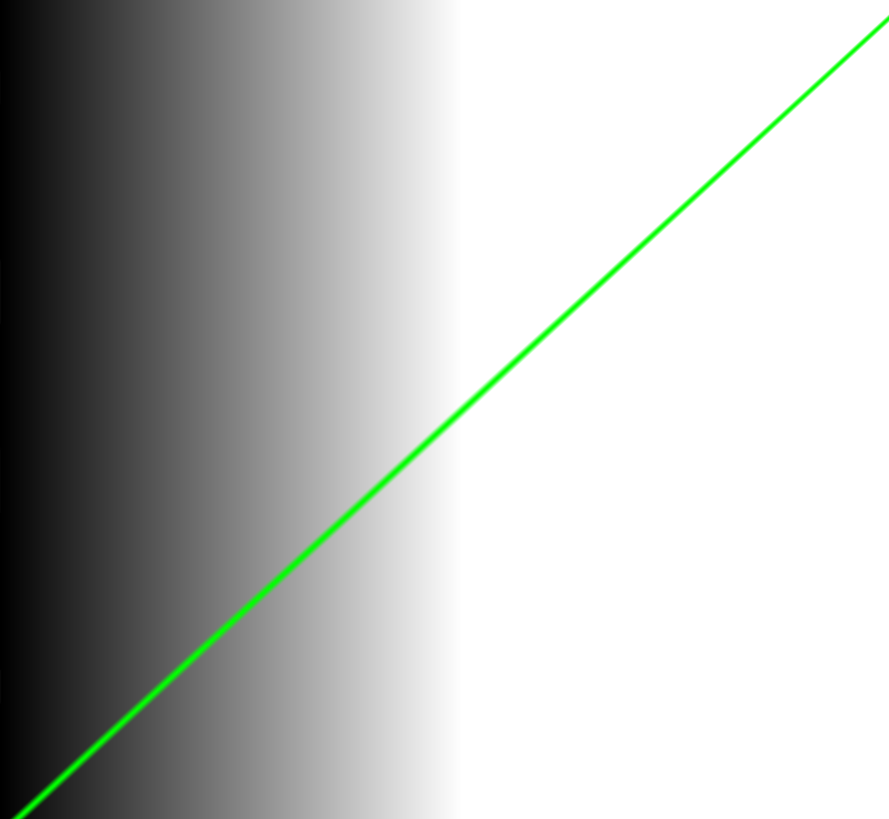
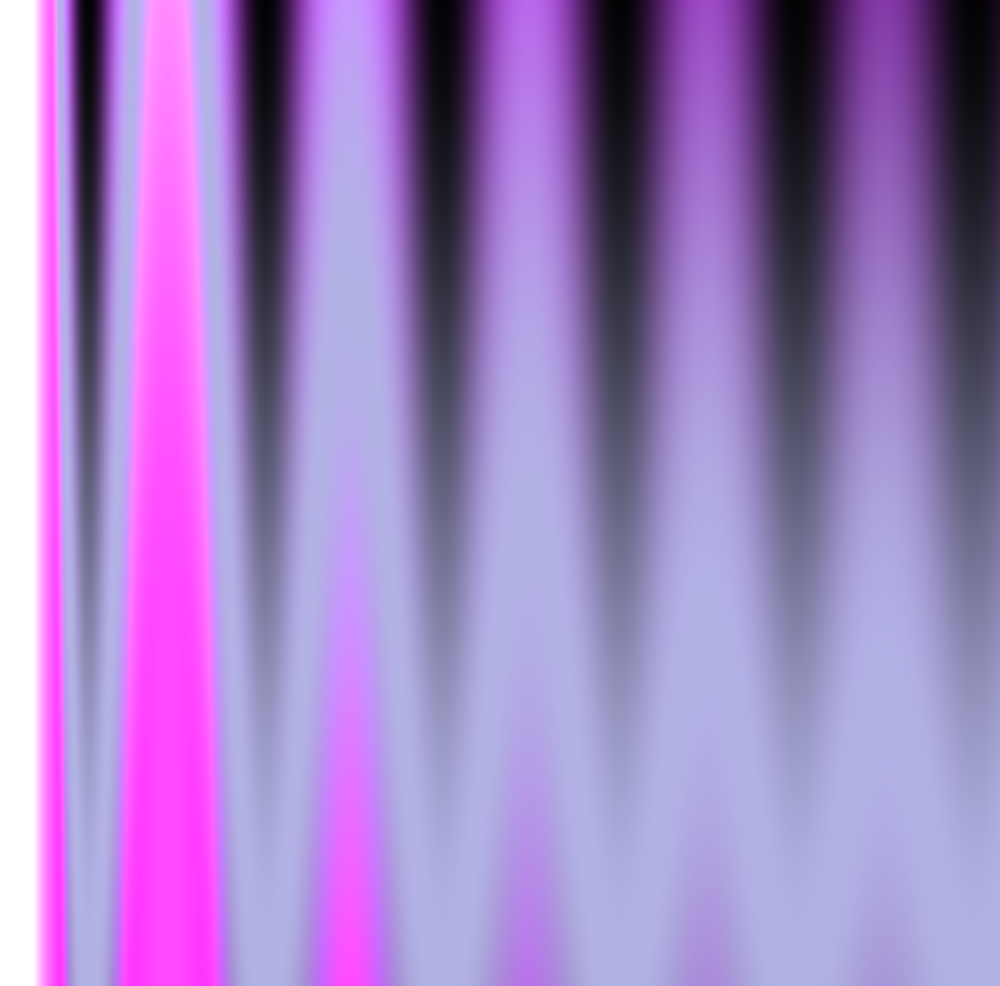
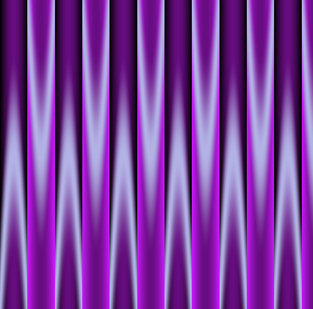
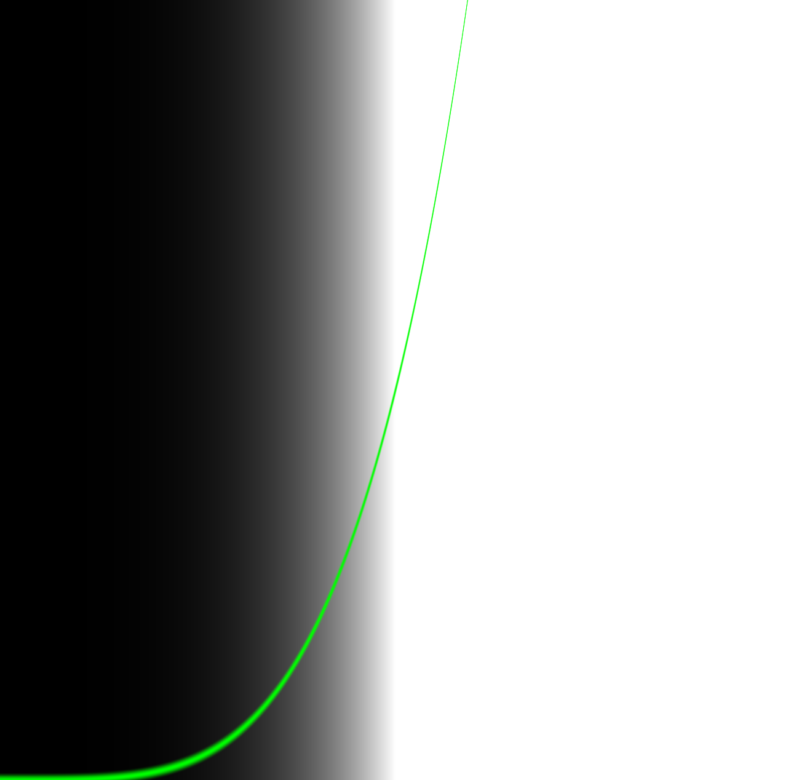
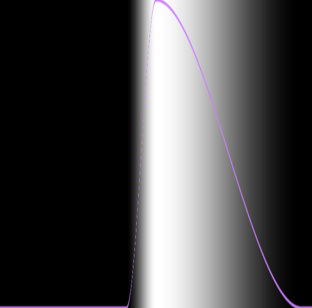

# Basic exercices

[Linear gradient](https://b2renger.github.io/p5js-shaders/Basics_bos/bos-shader-gradiant-00/)

[Sinus gradient 1](https://b2renger.github.io/p5js-shaders/Basics_bos/bos-shader-gradiant-sin00/)

[Sinus gradient 2](https://b2renger.github.io/p5js-shaders/Basics_bos/bos-shader-gradiant-sin01/)

[Power gradient ](https://b2renger.github.io/p5js-shaders/Basics_bos/bos-shader-gradiant-power/)

[Step gradient ](https://b2renger.github.io/p5js-shaders/Basics_bos/bos-shader-gradiant-step/)

[smooth step gradient ](https://b2renger.github.io/p5js-shaders/Basics_bos/bos-shader-gradiant-smoothstep/)

[color easing ](https://b2renger.github.io/p5js-shaders/Basics_bos/bos-shader-color-easing/)