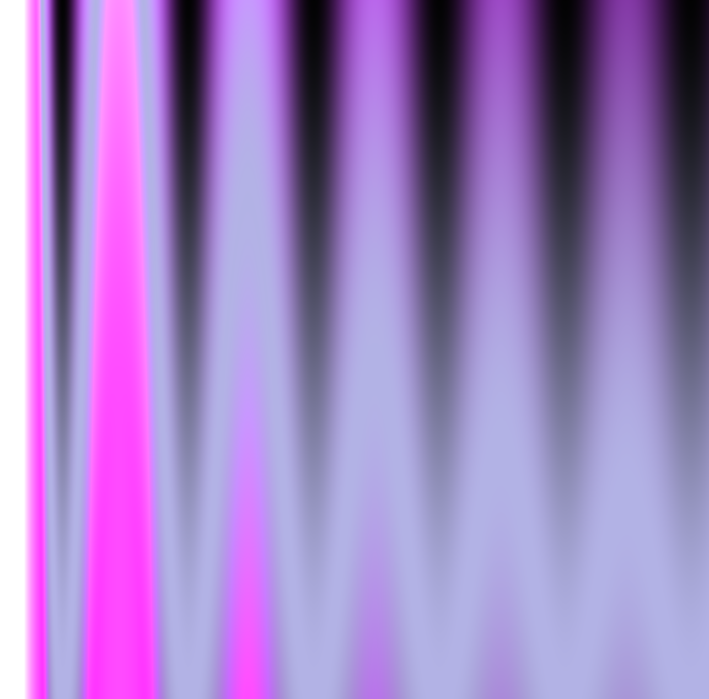
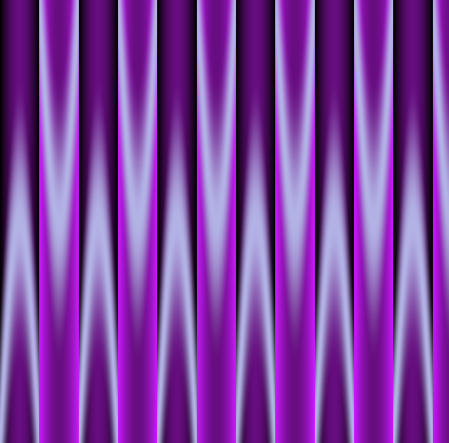
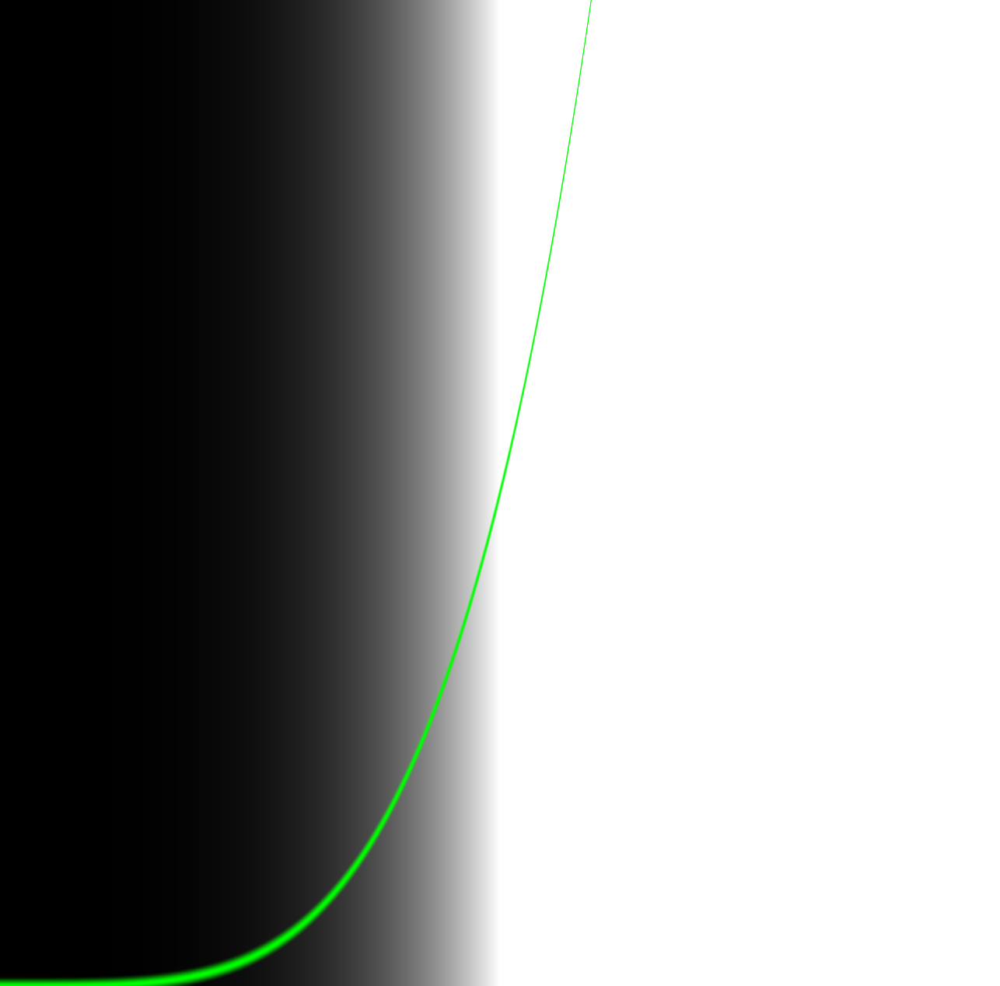
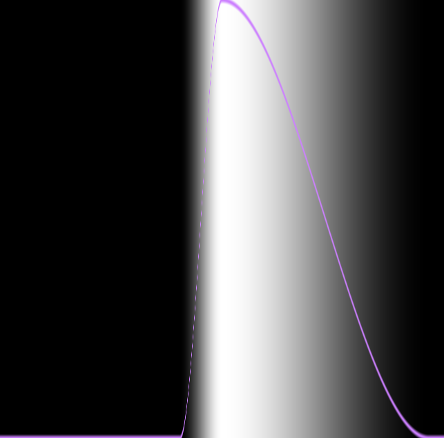

# p5js-shaders

Experiments with [p5js](https://p5js.org/) on [shaders](https://en.wikipedia.org/wiki/Shader).

Three great ressources from which examples here are inspired :
- [The book of Shaders](https://thebookofshaders.com/) by [Patricio Gonzales Vivo](http://patriciogonzalezvivo.com/)
- [p5js Shaders Examples](https://github.com/aferriss/p5jsShaderExamples) by [Adam Ferris](https://amf.fyi/)
- [p5js shaders](https://itp-xstory.github.io/p5js-shaders/#/)

  
  

## p5js examples

[Bloom on simple geometry](https://b2renger.github.io/p5js-shaders/shader-bloom/)

[Mandelbort](https://b2renger.github.io/p5js-shaders/p5js-shader-example-00/)

[All the blends in one shader](https://b2renger.github.io/p5js-shaders/shader-blends/)

## Book of shaders
  

### Examples from the book

[Linear gradient](https://b2renger.github.io/p5js-shaders/bos-shader-gradiant-00/)

[Sinus gradient 1](https://b2renger.github.io/p5js-shaders/bos-shader-gradiant-sin00/)

[Sinus gradient 2](https://b2renger.github.io/p5js-shaders/bos-shader-gradiant-sin01/)

[Power gradient ](https://b2renger.github.io/p5js-shaders/bos-shader-gradiant-power/)

[Step gradient ](https://b2renger.github.io/p5js-shaders/bos-shader-gradiant-step/)

[smooth step gradient ](https://b2renger.github.io/p5js-shaders/bos-shader-gradiant-smoothstep/)

[color easing ](https://b2renger.github.io/p5js-shaders/bos-shader-color-easing/)

### Examples loosely modified from the gallery

[Brownian motion](https://b2renger.github.io/p5js-shaders/bos-shader-gallery-brownian-motion/)

[Circlewave noise](https://b2renger.github.io/p5js-shaders/bos-shader-gallery-circlewave-noise/)

[Metaballs 00](https://b2renger.github.io/p5js-shaders/bos-shader-gallery-metaballs-00/)

[Metaballs 01](https://b2renger.github.io/p5js-shaders/bos-shader-gallery-metaballs-01/)

[Turbulence with symetry](https://b2renger.github.io/p5js-shaders/bos-shader-gallery-reflected-turbulence/)

[Terrain](https://b2renger.github.io/p5js-shaders/bos-shader-gallery-terrain/)

### Derived works from references presented in the book

[Mod of Danguafer's work](https://b2renger.github.io/p5js-shaders/bos-shader-demo-danguafer/)