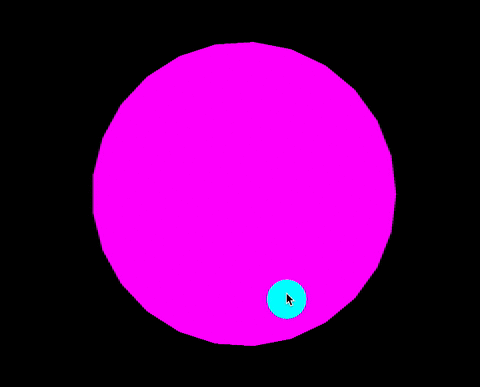

# p5js-shaders

Experiments with [p5js](https://p5js.org/) on [shaders](https://en.wikipedia.org/wiki/Shader).

Three great ressources from which examples here are inspired :
- [The book of Shaders](https://thebookofshaders.com/) by [Patricio Gonzales Vivo](http://patriciogonzalezvivo.com/)
- [p5js Shaders Examples](https://github.com/aferriss/p5jsShaderExamples) by [Adam Ferris](https://amf.fyi/)
- [p5js shaders](https://itp-xstory.github.io/p5js-shaders/#/)

  
  

## p5js examples

[Bloom on simple geometry](https://b2renger.github.io/p5js-shaders/shader-bloom/)

[Mandelbort](https://b2renger.github.io/p5js-shaders/p5js-shader-example-00/)

[All the blends in one shader](https://b2renger.github.io/p5js-shaders/shader-blends/)

[Mask an offscreen](https://b2renger.github.io/p5js-shaders/shader-mask/index.html)

## from Adam Ferris examples

[vertex displacement from texture](https://b2renger.github.io/p5js-shaders/AF-shader-vertex-displacement/)

## from Inigo Quilez examples

[radial FBM](https://b2renger.github.io/p5js-shaders/IQ-radial-FBM/)

## from the Twitter

[landscape from @kasari39](https://b2renger.github.io/p5js-shaders/fromTwitter_wavy_landscape/index.html)

[wobbly sphere from @nusan_fx](https://b2renger.github.io/p5js-shaders/fromTwitter_sphere_wobbly/index.html)

[wavy reflection from @nusan_fx](https://b2renger.github.io/p5js-shaders/fromTwitter_sphere_wavy_reflection/index.html)

## from the Pixel Spirit Deck

[pixel spirit deck recode](https://github.com/b2renger/p5js_pixel-spirit-deck_shaders)

## from the Book of shaders

### Recode from bos pages

[book of shaders examplesrecode](Basics_bos/README.md)

### Examples loosely modified from the gallery

[Brownian motion](https://b2renger.github.io/p5js-shaders/bos-shader-gallery-brownian-motion/)

[Circlewave noise](https://b2renger.github.io/p5js-shaders/bos-shader-gallery-circlewave-noise/)

[Metaballs 00](https://b2renger.github.io/p5js-shaders/bos-shader-gallery-metaballs-00/)

[Metaballs 01](https://b2renger.github.io/p5js-shaders/bos-shader-gallery-metaballs-01/)

[Turbulence with symetry](https://b2renger.github.io/p5js-shaders/bos-shader-gallery-reflected-turbulence/)

[Terrain](https://b2renger.github.io/p5js-shaders/bos-shader-gallery-terrain/)

### Derived works from references presented in the book

[Mod of Danguafer's work](https://b2renger.github.io/p5js-shaders/bos-shader-demo-danguafer/)