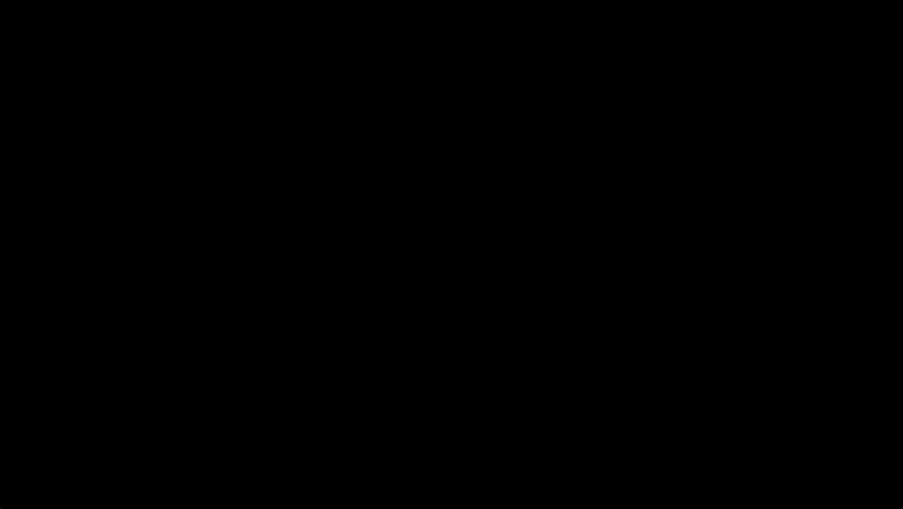

# Pixel Spirit Deck re-code

This is a re-code of the pixel spirit deck shaders for p5js.

Pixel spirit deck : https://patriciogonzalezvivo.github.io/PixelSpiritDeck/

[VOID](https://b2renger.github.io/p5js-shaders/pixel-spirit-deck/00_void/)

[JUSTICE](https://b2renger.github.io/p5js-shaders/pixel-spirit-deck/01_justice/)

[STRENGTH](https://b2renger.github.io/p5js-shaders/pixel-spirit-deck/02_strength/)